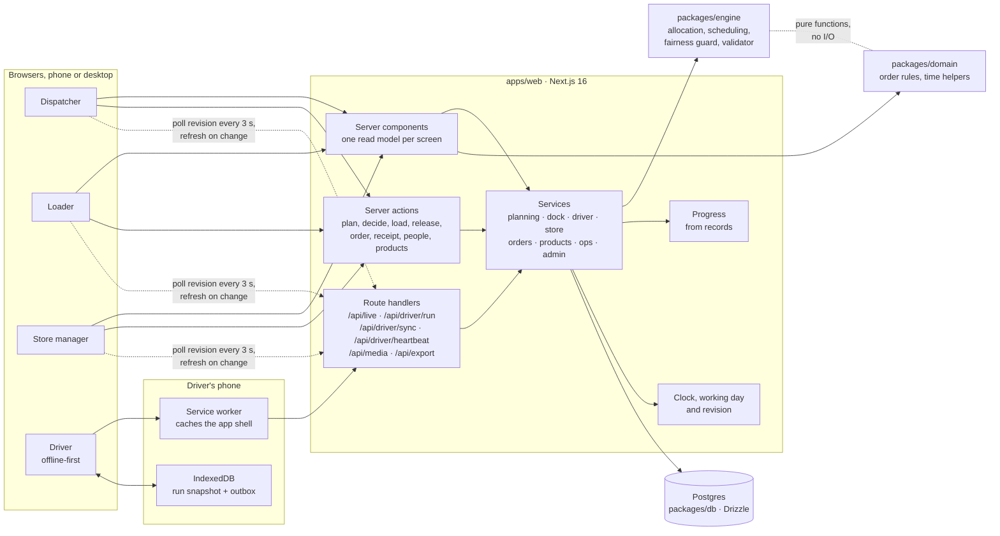
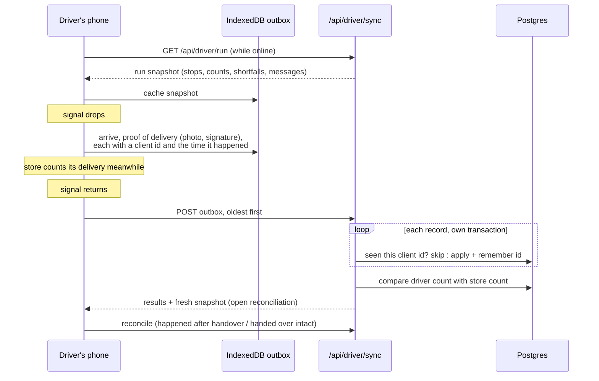

# Architecture

Relay is one Next.js application backed by Postgres, organised as a small monorepo. Planning logic lives in its own package with no framework or database code, so it can be tested on its own and reasoned about separately from the screens.

The diagrams below are also exported as images: [architecture.svg](architecture.svg) ([png](architecture.png)) and [offline-sync.svg](offline-sync.svg) ([png](offline-sync.png)).

## Packages

| Package | What it holds | Depends on |
| --- | --- | --- |
| `apps/web` | Screens for the four roles, server actions, route handlers, services and read models | all packages |
| `packages/engine` | The planner: time-window scheduling, allocation, the fairness guard, deferral reasons, KPIs, manual-move checks and an independent plan validator. Pure TypeScript, unit tested with `bun test` | nothing |
| `packages/db` | Drizzle schema, SQL migrations, the Postgres client, the seed (General Data files and four accounts) and a wipe script | `domain` |
| `packages/domain` | Order numbering, which temperatures each brand orders, and Asia/Colombo time helpers | nothing |

## Signing in and roles

Everyone signs in with an email and password at `/login` and lands on their role's home: dispatchers on the order queue, loaders on the dock, drivers on their run, store managers on their order. Every page, action and route handler checks the role again on the server, so a link to another role's screen sends the person back to their own.

A fresh install has one account per role. If there are none, the sign-in page offers to create the first dispatcher instead. Dispatchers manage accounts under *People*: add a person with their role and where they work (a depot, a vehicle or an outlet), switch an account off, or set a new password. Anyone can change their own password from the account menu. A switched-off account cannot sign in, and its open sessions end at the next request.

## How a request flows

- **Reads.** Every screen is a server component that calls one read model in `src/server/queries/*` (for example `planBoard`, `liveBoard`, `loadSheet`, `todayView`). Read models join the records the screen needs and shape them for display, so components stay presentational.
- **Writes.** Actions are server actions in `src/app/actions/*`. Each one checks the role, calls a service in `src/server/*` inside one database transaction, writes an event to the shared record, notifies the people affected and bumps the revision.
- **Staying current.** Open screens poll `/api/live` every three seconds for the revision number and refresh from the server when it changes, and once a minute regardless so arrival estimates and the cutoff countdown stay right. A plan published by dispatch reaches the dock within seconds; a store's receipt reaches the driver's reconcile screen the same way.

## Orders and products

`src/server/orders.ts` saves an outlet's orders for a day, from the store's form or dispatch's phone order, in one place. Where dispatch keeps products for the brand and temperature, an order is product quantities: each product is checked as still offered and right for the outlet's brand, and becomes a line with its weight and volume worked out from the per-unit figures. Otherwise the order is entered as units, weight and volume. The planner only ever sees each order's totals.

## Time and the working day

Relay runs on real Asia/Colombo time. Timestamps are stored as wall-clock strings without a zone (`'2026-10-05 06:23:00'`), so they never shift with the server's time zone.

- **Ordering.** A store orders for the next operating day. Orders close at 16:00 the day before (`orderingDay`); after that, new orders go to the run after. Operating days come from `calendar.csv` while it lasts, then Monday to Saturday.
- **The working day.** A depot works on the earliest delivery day that still has open orders (`workingDay`). The dock and the live board follow the earliest day with unfinished trips; a driver follows their earliest unfinished trip; a store follows its earliest open delivery.
- **Moving an order.** When a published plan defers an order, the order moves to the next run: its delivery day changes and it keeps the day it was for, the run it moved to and the reason. The store is told, and the order is planned again with that run's orders.

## Planning

`src/server/planning.ts` builds the engine's input from the database (confirmed orders for the working day, vehicles not in the workshop, fuel used so far this week, each outlet's skip history from the service log, and every person decision stored as a pin), runs the engine, and stores the result as a new draft version with its trips, stops, assignments and fairness decisions. Re-runs, decisions and manual moves each create the next version, so a plan's history is kept.

Publishing re-checks the draft with the engine's independent validator, then hands out the work: trip runs, stops and one loading unit per order for the dock and drivers; order statuses, the service log and the day's fuel per vehicle; deferred orders moved to the next run; and a notification to every store saying when its order arrives or why it moved. Republishing after a change keeps progress already made and tells the dock exactly what changed on each truck.

See [allocation-engine.md](allocation-engine.md) for the algorithm.

## Progress on the road

A trip's progress comes only from its records: the dock's ticks and release, the driver's acceptance, departure, arrivals and proof of delivery. Expected times for stops not yet reached are the plan's, shifted by how late the last arrival was, and never earlier than now while the truck is on the road.

While a run is under way the driver's phone sends a heartbeat every 30 seconds with its position when the driver allows location. Dispatch sees the last-heard time and a map link on the live board. A truck on the road that has not been heard from for three minutes shows as out of contact, and the store's screen says so while keeping the arrival window.

## Offline operation and recovery

The driver's app is the part of Relay that must work without a connection.

- A **service worker** caches the app shell and static assets, so the driver app opens with no signal, even after a reload.
- The **run snapshot** and the **outbox** live in IndexedDB. Every action creates a record with an id made on the phone and the time it happened, and updates the screen at once.
- **Sync is idempotent.** Records are applied oldest first, each in its own transaction, and each client id is stored. A retry after a dropped connection, or the same outbox sent twice, applies nothing twice.
- **Records keep their own time.** The record shows when a delivery happened, not when it reached the server. Times in the future are clamped to the server's time. The event log marks offline records as such.
- **Reconciliation.** If the store's count differs from the driver's handover once both are in, Relay opens a reconciliation the driver settles in two taps; a disputed count goes to dispatch with the photo and signature.

The other roles work at the depot or the counter, where connectivity is stable; their screens show clear errors and keep their state if a request fails.

## Security

- Passwords are hashed with scrypt; sessions are signed, HTTP-only cookies that name the account and when it was created, so a wiped and recreated account id never inherits an old session.
- Every page, action and API checks the user's role on the server. The proxy only redirects requests without a session cookie.
- Drivers can only act on their own vehicle's run; store managers only on their own outlet's orders.
- Photos and signatures are served only to signed-in users.

## Deployment

**Docker Compose** (`docker-compose.yml`) runs Postgres 17, a one-off `setup` job and the web app built as a standalone Node server. The `setup` job applies migrations and loads the General Data files and four accounts into an empty database.
