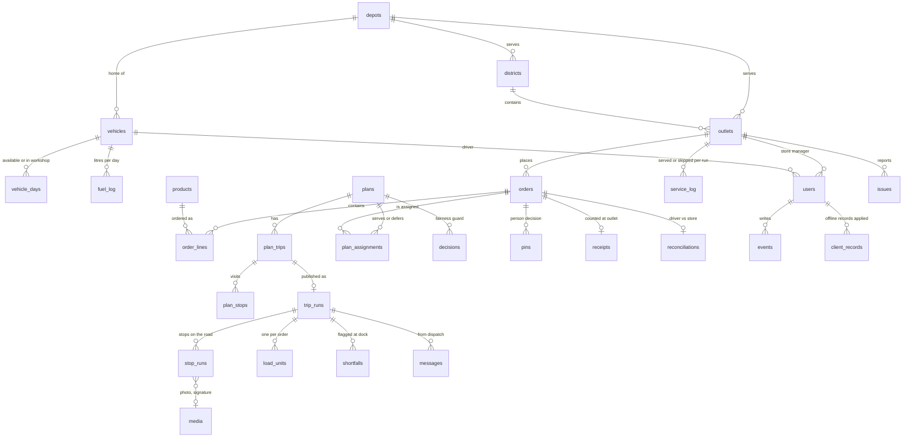

# Data model

Postgres, defined in `packages/db/src/schema.ts` with Drizzle and applied by the SQL migrations in `packages/db/migrations`.

The diagram is also exported as [data-model.svg](data-model.svg) ([png](data-model.png)).

Three groups of tables:

- **Reference data** is loaded from the General Data files: outlets, vehicles, districts (travel), service allowances and the calendar.
- **Planning** holds orders, each plan version and how it served or deferred every order, and the decisions people made.
- **Execution** holds one record per handoff: what was loaded and flagged at the dock, each stop on the road with its proof, each receipt at the outlet, and an append-only event log every role writes to.

Operational times are Asia/Colombo wall-clock timestamps without a zone (`'2026-10-05 06:23:00'`), so they never shift with the server's time zone. Plan times (`depart`, `eta`, windows) are minutes after midnight on the delivery day. `received_at` and `created_at` columns are server time with a zone, for audit.

## Reference data

| Table | From | Notes |
| --- | --- | --- |
| `depots` | | The depots the files name: Peliyagoda and Kandy |
| `districts` | `district_travel.csv` | Road class and free-flow travel from the depot and between stops |
| `outlets` | `outlets.csv` | Brand, district, depot, dock type, van-only or mall access, delivery window. The file has no outlet names, so `name` holds the district |
| `vehicles` | `vehicles.csv` | Type, refrigeration, weight and volume limits, fuel economy, weekly fuel quota, home depot |
| `vehicle_days` | | Availability per day, set by dispatch in the fleet records |
| `fuel_log` | | Litres per vehicle and day, written when a plan is published and summed from Monday for the weekly quota |
| `service_allowances` | `service_allowance.csv` | Handling minutes per brand and dock type |
| `calendar` | `calendar.csv` | Operating days, festivals and monsoon while the file lasts; after it, Monday to Saturday are operating days |
| `users` | | Name, email, role, phone, and where the person works: a depot, a vehicle or an outlet. Accounts can be switched off. Dispatchers add people under *People* |

## Planning

| Table | Purpose |
| --- | --- |
| `orders` | One per outlet, delivery day and temperature (Fresh supports chilled, frozen and ambient orders). Status: draft, confirmed, planned, loaded, delivered, received, failed. Channel: the store's app, or phoned in to dispatch. When a published plan defers an order it moves to the next run and keeps the day it was for, the run it moved to and the reason |
| `products` | What stores can order, kept by dispatch: code, name, brand, temperature, unit, weight and volume per unit, and whether it is still offered. Empty on a fresh install |
| `order_lines` | One line per product ordered, with the product's figures copied on so later edits don't change it; or one line of totals where the brand has no products. Receipts and shortfalls count against lines |
| `service_log` | Outcome of each past run per outlet and temperature. The fairness guard counts runs in a row where an outlet was skipped |
| `plans` | One row per version and depot: draft, published or superseded. KPIs, the planner's stats, the best-case refrigerated volume, input hash and the list of manual edits. The first draft closes that depot's queue |
| `plan_trips`, `plan_stops` | The engine's trips (vehicle, trip 1 or 2, district, departure, last stop, return, km, litres, load) and timed stops |
| `plan_assignments` | Every order in a plan: served on a trip, or deferred with a reason group and text, and whether a person must decide |
| `decisions` | Fairness guard decisions with the options the engine checked (swap, redirect a trip, add to a vehicle, defer) and what the dispatcher chose, kept after they are resolved |
| `pins` | Person decisions every re-run respects: put this order on that vehicle, or defer it with this reason |

## Execution

| Table | Purpose |
| --- | --- |
| `trip_runs` | A published trip being worked: status (planned → loading → released → accepted → on road → completed), handover code and QR token, seal, reefer temperature at release, departure, the phone's last heartbeat and position, and the plan change the dock must acknowledge |
| `load_units` | One per order on a trip, in stop order, with its status (pending, loaded, flagged) and who loaded it when |
| `shortfalls` | Damaged, missing, substituted or warm cases recorded before departure, with photo and the credit raised |
| `stop_runs` | Each stop: arrival, completion, counts handed over per order, receiver, probe temperature, photo, signature, whether it was recorded offline and when it synced |
| `receipts` | The store's count per line and its note or photo |
| `reconciliations` | Opened when the driver's handover and the store's count differ; resolved by the driver (after handover, or handed over intact for dispatch to review) |
| `messages`, `issues`, `notifications` | Dispatch to driver, store to dispatch, and what each person is told |
| `events` | The shared record: append only, one row per handoff or decision, with the time it happened, who did it, and whether it was recorded offline |
| `client_records` | Ids of offline records already applied, so a retried sync never applies one twice |
| `media` | Photos and signatures as bytes |
| `ops_state` | The revision number open screens poll to know when to refresh |
